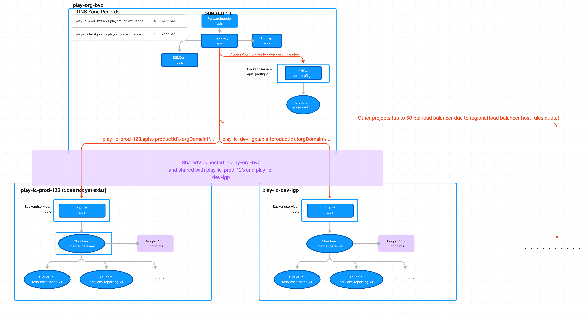

# Create cross-project google cloud load balancer with multiple grpc cloudrun services as backends

## Requirements and decisions made because of requirements

1. **Cross-project backends**: Need to use **Regional External Load Balancer**, since its the only type that currently supports this requirement.
2. **Grpc, http and grpc-web support**: To enable this, the load balancer does not point to the grpc services, but to **Google Cloud Endpoints (Envoy Proxies)** cloudrun instances that do any necessary http transcoding and connect to the actual grpc services. The proxy cloudrun is called _internal-gateway_
3. **Http/2** support: It has been tested that directly hitting the _internal-gateway_ cloudrun via the cloudrun-generated url, respects the _h2c_ enabled port of the container, thus not degrading grpc requests to http/1 before it hits the cloudrun container. However, this must also be the case between the load balancer the the _internal-gateway_ cloudrun, otherwise there is no point in using the load balancer.

## High-level architecture


## Steps taken to test

### Create ssl certificate that supports wildcard in play-org-bvz

0. Set project
```console
gcloud config set project play-org-bvz
```

1. Create dns authorizer

```console
gcloud certificate-manager dns-authorizations create apis --domain="playground.exchange" --location="europe-west1"
```

2. Describe the authorizer and create new dns record from output:
```console
gcloud certificate-manager dns-authorizations describe apis --location="europe-west1"

gcloud dns record-sets transaction start --zone=services

gcloud dns record-sets transaction add eaa43455-8cd2-44e3-bac3-3acbeb723c2b.2.europe-west1.authorize.certificatemanager.goog. --name=_acme-challenge_c5xklnwtsay5pclz.playground.exchange. --ttl="30" --type="CNAME" --zone="services"

gcloud dns record-sets transaction execute --zone="services"
```

3. Create ssl certificate and wait for it to be authorized
```console
gcloud certificate-manager certificates create apis --domains="*.playground.exchange,playground.exchange" --dns-authorizations=apis --location="europe-west1"

gcloud certificate-manager certificates describe apis --location=europe-west1
```

### Create shared vpc in play-org-bvz
0. Set project (should still be set from previous section)
```console
gcloud config set project play-org-bvz
```

1. Create load balancer network:
```console
gcloud compute networks create lb-network --subnet-mode=custom
```

2. Create subnet (not really sure what this one is for):
```console
gcloud compute networks subnets create lb-frontend-and-backend-subnet --network=lb-network --range=10.1.2.0/24 --region=europe-west1
```

3. Create proxy subnet:
```console
gcloud compute networks subnets create proxy-only-subnet \
    --purpose=REGIONAL_MANAGED_PROXY \
    --role=ACTIVE \
    --region=europe-west1 \
    --network=lb-network \
    --range=10.129.0.0/23
```

3. Create health check and proxy firewall rules:
```console
gcloud compute firewall-rules create fw-allow-health-check \
   --network=lb-network \
   --action=allow \
   --direction=ingress \
   --source-ranges=130.211.0.0/22,35.191.0.0/16 \
   --target-tags=load-balanced-backend \
   --rules=tcp

gcloud compute firewall-rules create fw-allow-proxies \
   --network=lb-network \
   --action=allow \
   --direction=ingress \
   --source-ranges=10.129.0.0/23 \
   --target-tags=load-balanced-backend \
   --rules=tcp:80,tcp:443,tcp:8080
```

4. Enabled shared vpc on play-org-bvz, making it a host project in your org
```console
gcloud compute shared-vpc enable play-org-bvz
```

5. Enable play-ic-dev-lgp as service project:
```console
gcloud compute shared-vpc associated-projects add play-ic-dev-lgp --host-project play-org-bvz
```

## Create preflight service in play-org-bvz
0. Set project (should still be set from previous section)
```console
gcloud config set project play-org-bvz
```

1. Create cloudrun
```console
gcloud run deploy apis-preflight --image=danielvniek/preflight-checker:latest --ingress=internal-and-cloud-load-balancing --allow-unauthenticated --region=europe-west1
```

2. Create serverless network endpoint group (SNEG):
```console
gcloud compute network-endpoint-groups create apis-preflight --region=europe-west1 --network-endpoint-type=serverless --cloud-run-service=apis-preflight
```

3. Create backend service for regional external loadbalancing with http ingress protocol and with logging enabled:
```console
gcloud compute backend-services create apis-preflight --enable-logging --load-balancing-scheme=EXTERNAL_MANAGED --protocol=HTTP --region=europe-west1
```

4. Add SNEG to backend service:
```console
gcloud compute backend-services add-backend apis-preflight --network-endpoint-group=apis-preflight --network-endpoint-group-region=europe-west1
```

### Create backend service in play-ic-dev-lgp

0. Set project
```console
gcloud config set project play-ic-dev-lgp
```

1. Create internal-gateway cloudrun instance with H2c port on 8080:
This was already done before with terraform and with the docker image built by Google Cloud Endpoints script.

2. Create serverless network endpoint group (SNEG):
```console
gcloud compute network-endpoint-groups create apis --region=europe-west1 --network-endpoint-type=serverless --cloud-run-service=internal-gateway
```

3. Create backend service for regional external loadbalancing with **http/2** ingress protocol and with logging enabled:
```console
gcloud compute backend-services create apis --enable-logging --load-balancing-scheme=EXTERNAL_MANAGED --protocol=HTTP2 --region=europe-west1
```

4. Add SNEG to backend service:
```console
gcloud compute backend-services add-backend apis --network-endpoint-group=apis --network-endpoint-group-region=europe-west1
```

### Create url map in play-org-bvz
0. Set project
```console
gcloud config set project play-org-bvz
```

1. Create map resource
```console
gcloud compute url-maps create apis --default-service=apis-preflight --region=europe-west1
```

2. Create yaml file with header based routing rules
Use map.yaml file next to this README.md and paste its content into map.yaml file in your terminal in the folder where you will run the next gcloud command. Then run:
```console
gcloud compute url-maps import apis --source=map.yaml
```
NOTE: for some reason I get (gcloud.compute.url-maps.validate) HTTPError 400: Invalid value for field 'resource.pathMatchers[0].defaultService': 'https://www.googleapis.com/compute/v1/projects/play-ic-dev-lgp/europe-west1/backendServices/apis'. The URL is malformed.

@Eduardo please help me understand what is wrong in this yaml. Luckilly testing the initial http/2 related error we do not need this mapping (its just for cors which I already tested as working correctly). So to proceed I just ran the following to always direct traffic to the *internal-gateway*:
```console
gcloud compute url-maps set-default-service apis --default-service=projects/play-ic-dev-lgp/regions/europe-west1/backendServices/apis --region=europe-west1
```

### Create load balancer (https-proxy, forwarding rule)
0. Set project
```console
gcloud config set project play-org-bvz
```

1. Create https proxy
```console
gcloud compute target-https-proxies create apis --url-map=apis --region=europe-west1 --certificate-manager-certificates=apis
```

2. Create a static ip address for the forwarding rule
```console
gcloud compute addresses create apis --region=europe-west1 --network-tier=STANDARD
```

3. Create forwarding rule
```console
gcloud compute forwarding-rules create apis \
  --load-balancing-scheme=EXTERNAL_MANAGED \
  --network=projects/play-org-bvz/global/networks/lb-network \
  --address=apis \
  --ports=443 \
  --region=europe-west1 \
  --target-https-proxy=apis \
  --target-https-proxy-region=europe-west1 \
  --network-tier=STANDARD
```

4. Add A record in dns for "apis.playground.exchange" that points to the ip address created in step 2.

## Testing and results
1. Make grpc request to apis.playground.exchange:443 using the same service account that the cloudrun is running with for GOOGLE_APPLICATION_CREDENTIALS.

This fails with 401 and when inspecting the logs I can see the request received by the cloudrun container used http/1.

2. Make grpc request directly to the internal-gateway's autogenerated cloudrun url using the same service account that the cloudrun is running with for GOOGLE_APPLICATION_CREDENTIALS.

This succeeds and when inspecting the logs I can see the request received by the cloudrun container uses H2C.


